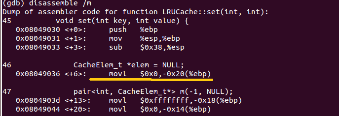
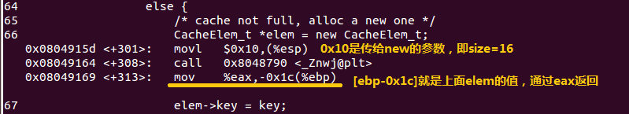

Title: gcc -Wshdow选项
Date: 2015-11-15
Category: c&c++
Tags: C C++ gcc Wshadow block scope
Author: jin

今天写LRU算法时遇到一个crash问题，代码如下：elem自动变为NULL，看了一会没找到elem为什么会变成null（很简单的手误，一眼就能看出来），上gdb，反汇编看看，果然一下就看出问题了，是个重复定义的问题，（但是g++编译器怎么没报错？？？后面解释），最开始I定义的elem地址为[ebp-0x20]，后面定义的一个elem地址为[ebp-0x1c]（函数局部变量都是通过ebp基址寄存器加偏移来获取的，栈向低地址生长）。

--------------------

关于编译器为什么没报错，在stackoverflow上看到了答案：c89/90/99和c++标准都允许这么做（查了下c99标准，讲得比较晦涩）。标准把这个叫做块作用域（block scope），一个block是包含在一对{}符号里面的代码，可嵌套（一个block内可保护另一个block），在一个block内定义的变量，该变量在整个block（包括内部嵌套的block都是可见的accessible），但是block之外是不不可见的，下面的代码编译会出错的：
    
    :::c
    {
        int  a = 10;
        ....
    }
    a = 11; //Comple error，a not declared

但是如果内嵌的block里面有一个变量与当前block里面的变量名一样怎么办？这两个变量将互不影响，该变量是在本block起作用，对于内嵌的block，inner block里面的变量会屏蔽outer block的变量，下面代码是正确的（注意两个a是不同的变量，虽然名字一样）：
    
    :::c
    {
         int a = 11; //在外面这个block起作用
        {
            int  a = 10;//这个a只在这个block里面起作用，并且把外面的a给屏蔽掉
            ....
            printf("a = %d\n", a); //本block的a, 'a = 10'
        }
        printf("a = %d\n", a); //这个a是最开始的那个a, 'a = 11'
    }

所以从这里我们可以看出第二个elem的作用域只存在于当前的block里面，而第一个elem的作用域存在于整个函数(除了包含第二个elem的block)。
另外，gcc编译器是可以发现这种问题的，有一选项叫-Wshadow，编译加上这个选项时，给出警告，提示：
    warning: declaration of ‘x’ shadows a previous local [-shadow]
注意这个选项并不包括在-Wall中（https://gcc.gnu.org/onlinedocs/gcc-3.4.4/gcc/Warning-Options.html）。

    :::c++
    void set(int key, int value) {
        CacheElem_t *elem = NULL;
        pair<int, CacheElem_t*> m(-1, NULL);
        unordered_map<int, CacheElem_t*>::const_iterator got;
        
        got = cache_map.find(key);
        if (got == cache_map.end()) {
            /* not found */
            if (count >= capacity) {
                /* cache full, so select the head of list as the eviction */
                elem = head.next;
                cache_map.erase(elem->key); /* remove the evicted and deleted key */
                elem->key = key;
                elem->value = value;
                assert(elem);
                list_del(elem);
                list_add_tail(&head, elem);
            }
            else {
                /* cache not full, alloc a new one */
                CacheElem_t *elem = new CacheElem_t;
                elem->key = key;
                elem->value = value;
                list_add_tail(&head, elem);
                count++;
            }
            /* add the new key map to cache_map */
            m.first = key;  
            m.second = elem; //elem总是为null,导致后面map查找时second为null后crash
            cache_map.insert(m);
        }
        else {
            /* found one, then update it, and move it to tail of list */ 
            elem = got->second;
            elem->value = value;
            if (elem != head.prev) {
                /* elem not in tail, move elem to tail of list */
                assert(elem);
                list_del(elem);
                list_add_tail(&head, elem);
            }
        }
    }
