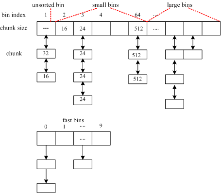

Title: ptmalloc内存管理解析
Date: 2015-11-18
Category: linux
Tags: linux glibc malloc ptmalloc
Author: jin

####1. 简介
内存管理是操作系统比较复杂的一环，对系统的性能有着关键性的作用，内存管理的知识涉及到内存分配算法，硬件的内存管理单元，
如MMU，Cache等单元。本文将简单分析一下我们使用的最多的mallc/free，这两个库函数是由glibc库提供的，通过调用系统的
sbrk和mmap来实现（小内存使用sbrk，大内存使用mmap）。glibc库的mallc最开始
是由Doug Lea实现的（也称dlmalloc），但由于其对并行多线程支持不好，所以后来在dlmalloc的基础上出现了ptmalloc，能较好的
支持编程，现在glibc使用的是ptmalloc3，也是本文分析的对象。另外，google自家也提供了一个malloc实现叫tcmalloc，性能比前面的都好，留待以后研究。

####2. 内存管理设计目标
衡量内存管理算法优劣的主要指标有如下几点：

* 分配与释放的快慢：主要考虑算法复杂度，如何利用局部性原理，并行无锁设计，cache的友好性；
* 内存碎片：如何尽可能的减少内存碎片，这跟分配算法相关，以及释放时如何合并等；
* 回收机制：高级语言都自带回收机制，主要算法有引用计数，Mark&Sweep，分代机制（利用对象的生存期）等；
* 跨平台可移植性：内存分配算法要与os打交道；
事实上，很难设计一种通用的内存分配算法，保证它的性能无论处于什么场景下都很好，这基本不可能。每一种内存分配算法都有它适用的场合，并且这种专用的内存分配算法比通用算法在特定环境中性能要更好，这就是为什么很多系统都有自己的专用内存管理机制，像
apache，nginx等。

####3. 内存结构组织
ptmalloc对空闲内存空间采用容器（bins）的组织方式，共有120个bins（外加10个fast bins），每个bins使用循环双向链表连接，
每个bins包含一系列的chunk，共有4种类型的bins：fast bins（10个）、unsorted bin（1个）、small bins（64个）、large bins，如图示，其中：

* small bins：每个bins的chunk大小都是一样的，并且每个bins的chunk大小都小于512 bytes，相邻bins的chunk size差为8 bytes；
* large bins：每个bins的chunk大小不一样，并且chunk按照大小排序；
* unsorted bin：只有一个这样的容器，这个容器的作用类似于作为small和large容器的缓存一样，当chunk分裂，
或者chunk被free时，chunk会先放到这个容器中，然后malloc分配时先从这个里面获取可用的chunk，至于为什么要
弄一个这样的容器，这主要是考虑到局部性原理。这个容器实际上是一个队列，由free将chunk放入，由malloc移除
（用于再分配或者移到small-large容器中）；

* fast bins：这个容器里面的chunk采用单链表，因为这个容器工作方式与栈类似，只操作头部，所以采用单链表，无序的
 ，LIFO，这个容器里面的chunks会一直设置inuse位，所以这些chunk不会被合并掉，而是由malloc_consolidate来进行处理
 和合并操作；

####4. 主要数据结构
1) struct malloc_state
malloc_state结构包含了所有的bins，mutex用于协调多个线程访问同一个分配区，binmap用于表示每个bin是否有空闲的chunk.

    struct malloc_state {
        /* Serialize access.  */
        mutex_t mutex;

        /* Statistics for locking.  Only used if THREAD_STATS is defined.  */
        long stat_lock_direct, stat_lock_loop, stat_lock_wait;
        long pad0_[1]; /* try to give the mutex its own cacheline */

        /* The maximum chunk size to be eligible for fastbin */
        INTERNAL_SIZE_T  max_fast;   /* low 2 bits used as flags */

        /* Fastbins */
        mfastbinptr      fastbins[NFASTBINS];

        /* Base of the topmost chunk -- not otherwise kept in a bin */
        mchunkptr        top;

        /* The remainder from the most recent split of a small request */
        mchunkptr        last_remainder;

        /* Normal bins packed as described above */
        mchunkptr        bins[NBINS * 2];

        /* Bitmap of bins */
        unsigned int     binmap[BINMAPSIZE];

        /* Linked list */
        struct malloc_state *next;

        /* Memory allocated from the system in this arena.  */
        INTERNAL_SIZE_T system_mem;
        INTERNAL_SIZE_T max_system_mem;
    };

每个进程都有如下一个全局变量，称为主分配区：
static struct malloc_state main_arena;

2) struct malloc_chunk
malloc_chunk表示每个chunk的结构，要注意每个chunk有两种状态：inuse和free，两种状态下结构体有所不同，free状态下多了两个指针（双向链表），这个主要用于该空闲chunk加入到容器中。

    struct malloc_chunk {

        INTERNAL_SIZE_T      prev_size;  /* Size of previous chunk (if free).  */
        INTERNAL_SIZE_T      size;       /* Size in bytes, including overhead. */

        struct malloc_chunk* fd;         /* double links -- used only if free. */
        struct malloc_chunk* bk;
    };

该结构体中size除了表示该chunk大小外，它的第三位用作其它用途：最低位的bit表示前一个chunk是否在使用中，倒数第一位
表示该chunk是否是mmap生成的，倒数第二位bit表示该chunk是否是从主分区分配过来的，这三位分别对应源码中的：prev_inuse，
chunk_is_mmapped，chunk_non_main_arena三个宏。
一个已分配的（inuse）的chunk布局如下，注意这里有一个很tricky的地方，就是已分配的chunk会将自己的大小size同时放在头部和尾部，因为尾部这个size域并没有在malloc_chunk结构体中定义，这个尾部size实际上是下一个相邻chunk的prev_size，为什么要这么做呢？这是为了使合并两个相邻空闲chunk时更快，由于有这个trick，每个chunk既能很快找到写一个物理相邻chunk的地址，又能很快得到前一个物理相邻chunk的地址（注意这里的物理相邻表示两个chunk的内存地址是前后连续的，要与其两个指针区别开来，前者用于内存碎片的合并，后者用于空闲chunk的管理）。mem是malloc返回给用户的实际地址。

        chunk-> +-+-+-+-+-+-+-+-+-+-+-+-+-+-+-+-+-+-+-+-+-+-+-+-+-+-+-+-+-+-+-+-+
                |             Size of previous chunk, if allocated            | |
                +-+-+-+-+-+-+-+-+-+-+-+-+-+-+-+-+-+-+-+-+-+-+-+-+-+-+-+-+-+-+-+-+
                |             Size of chunk, in bytes                   |A||M||P|
        mem-> +-+-+-+-+-+-+-+-+-+-+-+-+-+-+-+-+-+-+-+-+-+-+-+-+-+-+-+-+-+-+-+-+
                |             User data starts here...                          .
                .                                                               .
                .             (malloc_usable_space() bytes)                     .
                .                                                               |
    nextchunk-> +-+-+-+-+-+-+-+-+-+-+-+-+-+-+-+-+-+-+-+-+-+-+-+-+-+-+-+-+-+-+-+-+
                |             Size of chunk                                     |
                +-+-+-+-+-+-+-+-+-+-+-+-+-+-+-+-+-+-+-+-+-+-+-+-+-+-+-+-+-+-+-+-+

一个空闲的chunk结构如下：

        chunk-> +-+-+-+-+-+-+-+-+-+-+-+-+-+-+-+-+-+-+-+-+-+-+-+-+-+-+-+-+-+-+-+-+
                |             Size of previous chunk                            |
                +-+-+-+-+-+-+-+-+-+-+-+-+-+-+-+-+-+-+-+-+-+-+-+-+-+-+-+-+-+-+-+-+
        `head:' |             Size of chunk, in bytes                         |P|
        mem-> +-+-+-+-+-+-+-+-+-+-+-+-+-+-+-+-+-+-+-+-+-+-+-+-+-+-+-+-+-+-+-+-+
                |             Forward pointer to next chunk in list             |
                +-+-+-+-+-+-+-+-+-+-+-+-+-+-+-+-+-+-+-+-+-+-+-+-+-+-+-+-+-+-+-+-+
                |             Back pointer to previous chunk in list            |
                +-+-+-+-+-+-+-+-+-+-+-+-+-+-+-+-+-+-+-+-+-+-+-+-+-+-+-+-+-+-+-+-+
                |             Unused space (may be 0 bytes long)                .
                .                                                               .
                .                                                               |
        nextchunk-> +-+-+-+-+-+-+-+-+-+-+-+-+-+-+-+-+-+-+-+-+-+-+-+-+-+-+-+-+-+-+-+-+
        'foot:' |             Size of chunk, in bytes                           |
                +-+-+-+-+-+-+-+-+-+-+-+-+-+-+-+-+-+-+-+-+-+-+-+-+-+-+-+-+-+-+-+-+

####5. 算法分析
ptmalloc算法的主要特点：

* 对于large（request size >= 512bytes）请求，采用best-fit分配方法，并且应用了LRU（least recently used）算法（如果存在大小相同的chunk可用，会采用FIFO算法），
* 对于small （request size <= 64 bytes）的请求，采用缓存caching分配，（采用unsorted bins）；
* 对于small和large之间的请求，it does the best it can trying to meet both goals at once；
* 对于very large（request size >= 128 KB，默认DEFAULT_MMAP_THRESHOLD），则采用系统的mmap来实现；

内存分配的主要函数是public_mALLOc(size_t bytes)，该函数先检查hook函数，如果有则调用并直接返回，
这是为了进程创建时分配内存，同时也支持用户自定义分配函数；然后获取分配区指针，接着调用_int_malloc().
_int_malloc()是整个内存分配的核心，根据内存大小，依次按顺序从fast bins，small bins，large bins选取chunk。

####6. malloc钩子函数
前面提到public_mALLOc中有一个钩子函数hook，这是Glibc允许用户修改mallc/realloc/free的行为，可以在钩子函数
中加入debug功能，主要的钩子函数如下(摘自glibc manual手册)：

    Variable: __malloc_hook
    The value of this variable is a pointer to the function that malloc uses whenever it is called. You should define this function to look like malloc; that is, like:

    void *function (size_t size, const void *caller)
    The value of caller is the return address found on the stack when the malloc function was called. This value allows you to trace the memory consumption of the program.

    Variable: __realloc_hook
    The value of this variable is a pointer to function that realloc uses whenever it is called. You should define this function to look like realloc; that is, like:

    void *function (void *ptr, size_t size, const void *caller)
    The value of caller is the return address found on the stack when the realloc function was called. This value allows you to trace the memory consumption of the program.

    Variable: __free_hook
    The value of this variable is a pointer to function that free uses whenever it is called. You should define this function to look like free; that is, like:

    void function (void *ptr, const void *caller)
    The value of caller is the return address found on the stack when the free function was called. This value allows you to trace the memory consumption of the program.

    Variable: __memalign_hook
    The value of this variable is a pointer to function that aligned_alloc, memalign, posix_memalign and valloc use whenever they are called. You should define this function to look like aligned_alloc; that is, like:

    void *function (size_t alignment, size_t size, const void *caller)
    The value of caller is the return address found on the stack when the aligned_alloc, memalign, posix_memalign or valloc functions are called. This value allows you to trace the memory consumption of the program.

Mannual手册同时提供了一个简单例子如何定制自己的malloc钩子：

    /* Prototypes for __malloc_hook, __free_hook */
    #include <malloc.h>

    /* Prototypes for our hooks.  */
    static void my_init_hook (void);
    static void *my_malloc_hook (size_t, const void *);
    static void my_free_hook (void*, const void *);

    /* Override initializing hook from the C library. */
    void (*__malloc_initialize_hook) (void) = my_init_hook;

    static void
    my_init_hook (void)
    {
      old_malloc_hook = __malloc_hook;
      old_free_hook = __free_hook;
      __malloc_hook = my_malloc_hook;
      __free_hook = my_free_hook;
    }

    static void *
    my_malloc_hook (size_t size, const void *caller)
    {
      void *result;
      /* Restore all old hooks */
      __malloc_hook = old_malloc_hook;
      __free_hook = old_free_hook;
      /* Call recursively */
      result = malloc (size);
      /* Save underlying hooks */
      old_malloc_hook = __malloc_hook;
      old_free_hook = __free_hook;
      /* printf might call malloc, so protect it too. */
      printf ("malloc (%u) returns %p\n", (unsigned int) size, result);
      /* Restore our own hooks */
      __malloc_hook = my_malloc_hook;
      __free_hook = my_free_hook;
      return result;
    }

    static void
    my_free_hook (void *ptr, const void *caller)
    {
      /* Restore all old hooks */
      __malloc_hook = old_malloc_hook;
      __free_hook = old_free_hook;
      /* Call recursively */
      free (ptr);
      /* Save underlying hooks */
      old_malloc_hook = __malloc_hook;
      old_free_hook = __free_hook;
      /* printf might call free, so protect it too. */
      printf ("freed pointer %p\n", ptr);
      /* Restore our own hooks */
      __malloc_hook = my_malloc_hook;
      __free_hook = my_free_hook;
    }

    main ()
    {
      …
    }

###References:
1. dlmalloc: http://gee.cs.oswego.edu/dl/html/malloc.html;
2. 淘宝华庭：Glibc内存管理
