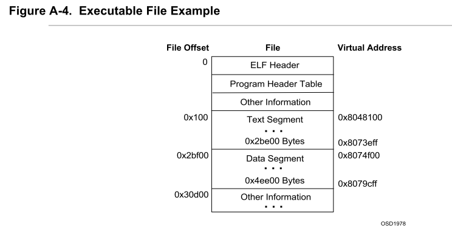
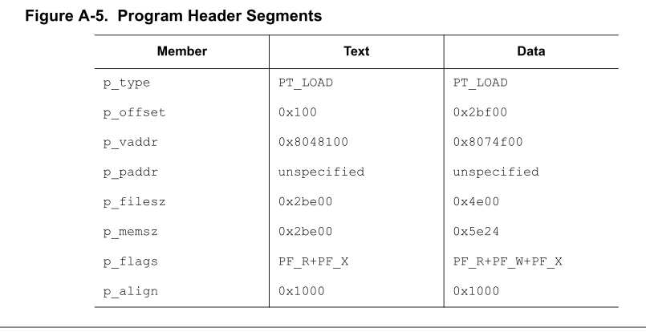
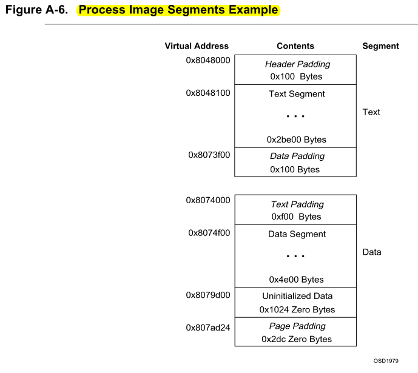
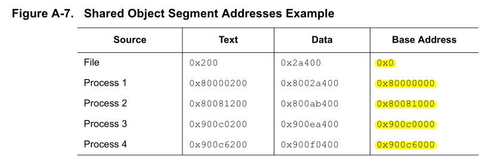

Title: ELF文件
Date: 2013-1-15
Category: os
Tags: os, bootloader, elf, header, linker
Author: jin

ELF(Executable	and	linking	format)文件格式是Linux系统下的一种常用目标文件(object	file)格式，有三种主要类型:

* 用于执行的可执行文件(executab	file)，用于提供程序的进程映像，加载的内存执行。	这也是本实验的OS文件类型。

* 用于连接的可重定位文件(relocatable file)，可与其它目标文件一起创建可执行文件和共享目标文件。

* 共享目标文件(shared	object	file),连接器可将它与其它可重定位文件和共享目标文件连接成其它的目标文件，
动态连接器又可将它与可执行文件和其它共享目标文件结合起来创建一个进程映像。

ELF文件是由一个ELF header和紧接着的几个program header（长度不等），这些program header指明了每个段的大小和内容，如：

*.text

*.rodata

*.data

####1. Elf header结构

这里只分析与本实验相关的ELF可执行文件类型。ELF	header在文件开始处描述了整个文件的组织。ELF的文件头包含整个执行文件的
控制结构，其定义在elf.h中：

    :::c
    struct	elfhdr	{
      uint	magic;	 //	must	equal	ELF_MAGIC
      uchar	elf[12];
      ushort	type;
      ushort	machine;
      uint	version;
      uint	entry;	 //	程序入口的虚拟地址
      uint	phoff;	 //	program	header	表的位置偏移
      uint	shoff;
      uint	flags;
      ushort	ehsize;
      ushort	phentsize;
      ushort	phnum;	//program	header表中的入口数目
      ushort	shentsize;
      ushort	shnum; //section 数目
      ushort	shstrndx;
    };

主要字段意义如下：

* e_entry: This member gives the virtual address to which the system first transfers control, 
thus starting the process. If the file has no associated entry point, this member holds 
zero.

* e_phoff This member holds the program header table's file offset in bytes. If the file has no 
program header table, this member holds zero.

* e_shoff This member holds the section header table's file offset in bytes. If the file has no 
section header table, this member holds zero.

* e_flags This member holds processor-specific flags associated with the file. Flag names 
take the form EF_machine_flag

* e_ehsize This member holds the ELF header's size in bytes. 

* e_phentsize This member holds the size in bytes of one entry in the file's program header table; 
all entries are the same size.

* e_phnum This member holds the number of entries in the program header table. Thus the 
product of e_phentsize and e_phnum gives the table's size in bytes. If a file 
has no program header table,  e_phnum holds the value zero.

* e_shentsize This member holds a section header's size in bytes. A section header is one entry 
in the section header table; all entries are the same size.

* e_shnum This member holds the number of entries in the section header table. Thus the 
product of e_shentsize and e_shnum gives the section header table's size in 
bytes. If a file has no section header table,  e_shnum holds the value zero.

* e_shstrndx This member holds the section header table index of the entry associated with the 
section name string table

####2. Section header结构
Section header表主要是用于定位文件的每个段，section结构如下：

    :::c
    typedef struct {
        Elf32_Word   sh_name;
        Elf32_Word   sh_type;
        Elf32_Word   sh_flags;
        Elf32_Addr   sh_addr;
        Elf32_Off    sh_offset;
        Elf32_Word   sh_size;
        Elf32_Word   sh_link;
        Elf32_Word   sh_info;
        Elf32_Word   sh_addralign;
        Elf32_Word   sh_entsize;
    } Elf32_Shdr;

* sh_name This member specifies the name of the section. Its value is an index into 
the section header string table section [see "String Table'' below], giving 
the location of a null-terminated string.

* sh_type This member categorizes the section's contents and semantics. Section 
types and their descriptions appear below.
sh_flags Sections support 1-bit flags that describe miscellaneous attributes. Flag 
definitions appear below.

* sh_addr If the section will appear in the memory image of a process, this member 
gives the address at which the section's first byte should reside. Otherwise, 
the member contains 0.

* sh_offset This member's value gives the byte offset from the beginning of the file to 
the first byte in the section. One section type, SHT_NOBITS described 
below, occupies no space in the file, and its sh_offset member locates 
the conceptual placement in the file.

* sh_size This member gives the section's size in bytes.  Unless the section type is 
SHT_NOBITS, the section occupies sh_size bytes in the file. A section 
of type SHT_NOBITS may have a non-zero size, but it occupies no space 
in the file.

* sh_link This member holds a section header table index link, whose interpretation 
depends on the section type. A table below describes the values.

* sh_info This member holds extra information, whose interpretation depends on the 
section type. A table below describes the values.

* sh_addralign Some sections have address alignment constraints. For example, if a section 
holds a doubleword, the system must ensure doubleword alignment for the 
entire section.  That is, the value of sh_addr must be congruent to 0, 
modulo the value of sh_addralign. Currently, only 0 and positive 
integral powers of two are allowed. Values 0 and 1 mean the section has no 
alignment constraints.

* sh_entsize Some sections hold a table of fixed-size entries, such as a symbol table. For 
such a section, this member gives the size in bytes of each entry. The 
member contains 0 if the section does not hold a table of fixed-size entries.

####3. Program Header结构
program	header描述与程序执行直接相关的目标文件结构信息，用来在文件中定位各个段的映像，同时包含其他一些用来为
程序创建进程映像所必需的信息。可执行文件的程序头部是一个program	header结构的数组，	每个结构描述了一个段或者系统准备程序执行i
所必需的其它信息。目标文件的“段”包含一个或者多个section，也就是“段内容（Segment Contents）”。
程序头部仅对于可执行文件和共享目标文件有意义。可执行目标文件在ELF头部的e_phentsize和e_phnum成员中给出其自身程序头部的大小。
程序头部的数据结构如下表所示：

    :::c
    struct	proghdr	{
      uint	type;	 //	段类型
      uint	offset;	 //	段相对文件头的偏移值
      uint	va;	 //	段的第一个字节将被放到内存中的虚拟地址
      uint	pa;
      uint	filesz;
      uint	memsz;	 //	段在内存映像中占用的字节数
      uint	flags;
      uint	align;
    };
va是进程需要加载到的虚拟地址，对于可执行文件，这个va就是系统加载的虚拟地址；二对于共享目标文件，由于这些段包含的是与位置无关的
代码，这个va是相对地址。
下面的图是官方文档给出的可执行文件和共享目标文件加载的两个例子：
1）可执行文件
下图是一个elf文件的典型结构：

下面是给出了text和data段的program header的成员值：

下面这个图就是进程加载后的映像：

2）共享目标文件
下图给出了4个进程同时加载这个共享目标文件到各自的地址空间，可以看出，加载的地址并不意义，但是相对地址保持不变：

####4. OS如何加载elf文件
OS创建进程映像（也就是加载elf可执行文件）需要将文件的各个段（program header）拷贝到相应的进程虚拟地址空间，此时并不需

###[补充材料]
Link	addr&Load	addr

* Link Address是指编译器指定代码和数据所需要放置的内存地址，由链接器配置。
* Load	Address是指程序被实际加载到内存的位置（由程序加载器ld配置）。一般由可执行文件结构信息和加载器可保证这两个地址相同。
Link Addr和LoadAddr不同会导致：直接跳转位置错误直接内存访问(只读数据区或bss等直接地址访问)错误堆和栈等的使用不受影响，
但是可能会覆盖程序、数据区域	注意：也存在Link地址和Load地址不一样的情况（例如：动态链接库）。

###References:
1. [Executable and Linking Format (ELF) SpecificationVersion 1.2](https://refspecs.linuxbase.org/elf/elf.pdf)
