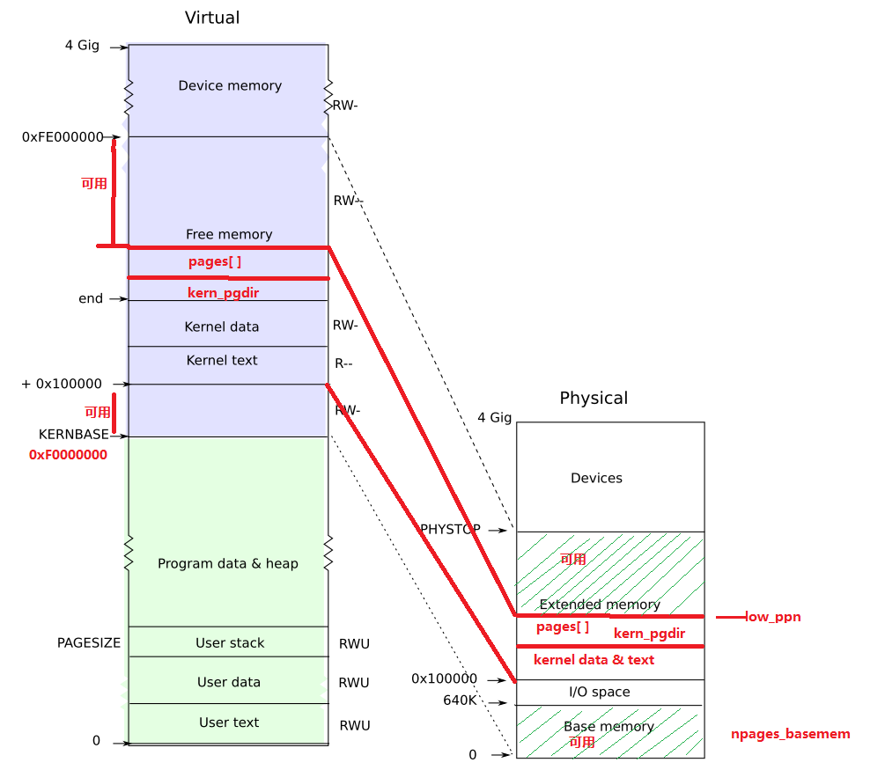

Title: lab2-exercise1：physical memory management
Date: 2014-2-16
Category: os
Tags: os, physical memory management, page
Author: jin

这部分内容主要是完成物理页的初始化，完成物理页pages数组的映射，并初始化page_free_list。exercise1的内存布局如图，
前面（entry.S）提到内核的c代码被链接到了到0xF0100000处（下图中KERNBASE=0xF0000000），而entry.S最后使能了分页机制，
也就是进入内核的c代码后，所有的地址都是虚拟地址，也就是左边的地址空间，但是内核的c代码的物理内存仍在0x100000处，
所以要建立一个映射，也就是图中的映射。该练习主要完成一下几个函数：

boot_alloc()

mem_init() (only up to the call to check_page_free_list(1))

page_init()

page_alloc()

page_free()

####1. boot_alloc
是开始阶段的内存分配，注意它是从end（内核所占空间的结尾）开始分配内存，后面的虚拟地址都是可用的，这个函数是以页为分配单位，就算n不足4KB，也会分配一页。
    
    
    :::c
    static void *
    boot_alloc(uint32_t n)
    {
        static char *nextfree;    // virtual address of next byte of free memory
        char *result;

        // Initialize nextfree if this is the first time.
        // 'end' is a magic symbol automatically generated by the linker,
        // which points to the end of the kernel's bss segment:
        // the first virtual address that the linker did *not* assign
        // to any kernel code or global variables.
        if (!nextfree) {
            extern char end[];
            nextfree = ROUNDUP((char *) end, PGSIZE);
        }

        // Allocate a chunk large enough to hold 'n' bytes, then update
        // nextfree.  Make sure nextfree is kept aligned
        // to a multiple of PGSIZE.
        //
        // LAB 2: Your code here.
        result = nextfree;
        nextfree += n;
        nextfree = ROUNDUP(nextfree, PGSIZE);
        return result;
    }

####2. mm_init
1）内核内存初始化函数，先检查物理内存大小（算出npages和npage_basemem）；

2）创建页目录kern_pgdir = boot_alloc(PGSIZE)；

在UVPT处创建一个virtual page table；

3）分配pages数组：pages = boot_alloc(npages * sizeof(PageInfo)); 分配npages一个PageInfo结构，每个PageInfo对应一个物理页；
4）调用page_init()来初始化pages数组：page_init主要将pages数组的每个元素加入到一个page_free_list链表中，并完成pages数组
与物理内存的映射，注意由于可用的物理内存空间不是连续的，具体可用的内存如下图，左边是虚拟内存的角度来看，右边是从物理内存
的角度看。

5）接下来的任务是完成虚拟内存映射，exercise2的主要内容，见后文分析.

####3. page_init
该函数完成pages[]数组与物理页的映射，所有的物理页对应这个数组的一项，物理地址的高20位就是pages数组的index。
这个函数很关键，实现这个函数首先需要理解内核运行到这里的时候，整个物理地址空间与虚拟地址空间的映射是什么样的关系，
如下图所示。
这里再解释一下这个映射是怎么来的？
在entry.S的结束部分我们启用了分页机制，此时所用的页目录是什么呢？答案是entry_pgdir，entry.S启用分页代码如下：

    movl    $(RELOC(entry_pgdir)), %eax
    movl    %eax, %cr3
    #Turn on paging.
    movl    %cr0, %eax
    orl    $(CR0_PE|CR0_PG|CR0_WP), %eax
    movl    %eax, %cr0

这里将entry_pgdir指定为页目录，entry_pgdir定义如下：
    
    
    :::c
    pde_t entry_pgdir[NPDENTRIES] = {
        // Map VA's [0, 4MB) to PA's [0, 4MB)
         [0]
            = ((uintptr_t)entry_pgtable - KERNBASE) + PTE_P,
        // Map VA's [KERNBASE, KERNBASE+4MB) to PA's [0, 4MB)
        [KERNBASE>>PDXSHIFT]
            = ((uintptr_t)entry_pgtable - KERNBASE) + PTE_P + PTE_W
    };

这个页目录所做的工作就是将虚拟地址空间[KERNBASE, KERNBASE+4MB]映射到物理地址空间[0, 4MB]，为什么要这么映射？因为内核的c代码部分被链接器加载到KERNBASE虚拟地址（高端地址空间），而内核的image的实际物理地址仍在[0,4MB]里，至于为什么只映射4MB的空间而不映射更多的？这是因为一个页表刚好能映射4MB空间，而且4MB已经足够用，所以就选择4MB，
并且这个映射还只是暂时，只是一个过渡阶段。

虚拟内存角度：左边图中标出的两个可用的就是可用的虚拟内存，需要将这部分对应的pages元素加入到page_free_list链表，而不可用的部分不能加入该链表，同时要设置其pp_ref为1，表示已被占用。
物理内存角度：右边标出了对应的映射图，两个可用的部分加入到page_free_list。
所以实现page_init有两种做法，第一是从虚拟内存的角度来做，但是左边图中有个小错误，没有将I/O映射的部分空间去除掉，也就是第一部分可用的空间为KERNBASE ~ （KERNBASE + 640K）；

下面我们从物理内存的角度去实现，
1）完成0 ~ 640K的初始化，加入到free_page_list：

     for (i = 1; i < npages_basemem; i++) {
          pages[i].pp_ref = 0;
          pages[i].pp_link = page_free_list;
          page_free_list = &pages[i];
     }
2）将I/O space、kernel data & text、kern_pgdir、pages[]所占的空间设为不可用：
    
    
    :::c
    char * first_page = boot_alloc(0);  //这个first_page指向第二块可用空间的开始处，
                                    //也即page[]结尾处；但是这个值是虚拟地址空间的，需要将其映射到物理内存地址；

    low_ppn = PADDR(first_page)/PGSIZE; //计算出first_page 对应的物理内存页；
    for (i = npages_basemem; i < low_ppn; i++) {
        pages[i].pp_ref = 1;
        pages[i].pp_link = NULL;
    }

3）将第二部分可用内存空间加入到page_free_list：

    for (i = low_ppn; i < npages; i++) {
        pages[i].pp_ref = 0;
        pages[i].pp_link = page_free_list;
        page_free_list = &pages[i];
    }

####4. page_alloc

page_init完成后后面就很好做了，后面的物理内存分配都是采用page_alloc函数，前面的boot_alloc到这之后就不在用了。
该函数从page_free_list中选一个空闲物理页，并初始化物理页。PageInfo结构体里面有一个pp_ref，表示该物理页的引用计数，
因为我们可以将一个物理页映射到多个虚拟地址空间，也即多个虚拟地址空间映射到同一个物理页，这个pp_ref就是为了表示这个
物理页被多少个虚拟页映射。

    
    :::c
    struct PageInfo *
    page_alloc(int alloc_flags)
    {
        // Fill this function in
        struct PageInfo *page;

        if (!page_free_list)
            return NULL;
        page = page_free_list;
        page_free_list = page->pp_link; 
        page->pp_link = NULL;
        if (alloc_flags & ALLOC_ZERO) {
            memset(page2kva(page), 0, PGSIZE);    
        }
        return page;
    }

####5. page_free

该函数主要完成物理页的释放，将释放后的物理页加入到page_free_list中。

    :::c
    void
    page_free(struct PageInfo *pp)
    {
        // Fill this function in
        // Hint: You may want to panic if pp->pp_ref is nonzero or
        // pp->pp_link is not NULL.
        if (pp->pp_ref != 0) {
            panic("page_free pp->pp_ref wrong");
        }
        pp->pp_link = page_free_list;
        page_free_list = pp;
    }
