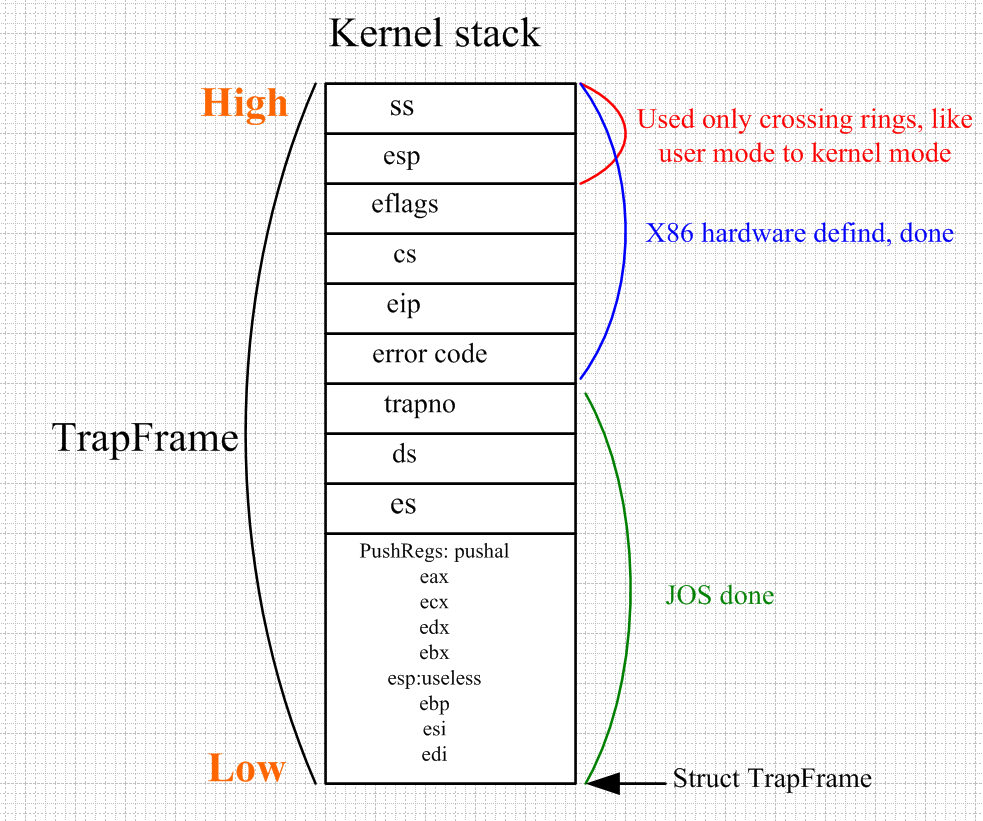

Title: lab3:user mode与kernel mode的切换
Date: 2014-4-5
Category: os
Tags: os, user mode, kernel mode, tast state, TrapFrame
Author: jin

两个模式切换涉及两个很重要的数据结构：Taskstate和TrapFrame，Taskstate前面已提到，这个在cpu初始化时会调用trap_init_percpu将设置这个结构体中的栈寄存器和段寄存器：
tss->ts_esp0 = 每个cpu的栈top;
tss->ts_ss0 = GD_KD; 内核的数据段选择子

每个cpu都有一个这样的结构：thiscpu->cpu_ts，这个是为了当从用户态切换到内核态时，让cpu能找到内核栈和数据段的地址。

TrapFrame用在内核态与用户态相互切换时，当从user mode切换到kernel mode时，cpu会将当前进程的状态信息以TrapFrame的形式
保存在cpu的内核栈上（内核栈地址由上面的tss给出），而当cpu从kernel mode返回时，会从内核栈上pop出进程的状态信息，然后继续进程的运行。
下面从两种模式切换时trapframe的作用。

####1) 从user mode到kernel mode
发生这种切换时，内核也必须保存当前用户进程的状态，以便返回时可以继续执行，用户进程的状态就保存在TrapFrame结构中，
那么cpu是怎么做的呢？
先看TrapFrame结构：

    :::c
    struct PushRegs {
        /* registers as pushed by pusha */
        uint32_t reg_edi;
        uint32_t reg_esi;
        uint32_t reg_ebp;
        uint32_t reg_oesp;        /* Useless */
        uint32_t reg_ebx;
        uint32_t reg_edx;
        uint32_t reg_ecx;
        uint32_t reg_eax;
    } __attribute__((packed));

    struct Trapframe {
        struct PushRegs tf_regs;
        uint16_t tf_es;
        uint16_t tf_padding1;
        uint16_t tf_ds;
        uint16_t tf_padding2;
        uint32_t tf_trapno;
        /* below here defined by x86 hardware */
        uint32_t tf_err;
        uintptr_t tf_eip;
        uint16_t tf_cs;
        uint16_t tf_padding3;
        uint32_t tf_eflags;
        /* below here only when crossing rings, such as from user to kernel */
        uintptr_t tf_esp;
        uint16_t tf_ss;
        uint16_t tf_padding4;
    } __attribute__((packed));

上面这些值（主要是寄存器）就是cpu从用户态切换到内核态需要保存的（PushRegs里面的通用寄存器是用于向内核传递参数，如系统调用号就是用eax传递的，返回值也是eax；然后是段寄存器，cs：eip用于返回时继续执行）。切换的入口在trapentry.S中：
以系统调用的代码为例：
这个handler_sysall的代码：

    #define TRAPHANDLER_NOEC(name, num)                    \
        .globl name;                            \
        .type name, @function;                        \
        .align 2;                            \
        name:                                \
        pushl $0;                            \
        pushl $(num);                            \
        jmp _alltraps
    
下面是_alltraps的代码：

    .globl _alltraps
    .type _alltraps, @function
    .align 2
    _alltraps:
        pushl %ds
        pushl %es
        pushal

        movw $GD_KD, %ax
        movw %ax, %ds
        movw %ax, %es

        pushl %esp
        call trap
        addl $4, %esp
    .globl trapret
    trapret:
        popal
        pop %es
        pop %ds
        addl $0x8, %esp
        iret

_alltraps中会调用trap()函数，我们知道trap函数的参数TrapFrame，所以这个TrapFrame参数是在前面两段汇编代码里面传进去的，现在好办了，只要看看这些汇编代码是怎么处理栈（参数是通过栈传递）？
由于栈是从高地址往低地址生长，所以入栈的顺序应该与寄存器在TrapFrame的位置顺序相反：
也就是从call trap指令往上看，先pushal，这个对应将PushRegs入栈，然后es，ds，再到num，0为止。tf_trapno后面的值都不是这里操作的。
TrapFrame的结构如下图所示：

####2) 从kernel mode到user mode
从中断（如缺页，外设中断）返回时，或者从系统调用返回时（excptions发生时，用户进程会被终止）。下面先说一种情况，就是cpu调度一个新的进程运行，
此时一般是先从user mode到kernel mode，然后从kernel mode再到user mode，只是换了一个新的进程在执行。什么情况会出现这种情况呢？常见的就是用户进程执行某个系统调用阻塞了
（如以阻塞方式读取网络设备的数据，数据还没ready，或者等待某个信号量，或者sleep），此时cpu会调度另外一个进程运行。JOS中sched_yield实现了进程调度，而完成从kernel mode到user mode切换的就是其中的env_run(new_process)：

    :::c
    if (curenv != NULL) {
        if (curenv->env_status == ENV_RUNNING)
            curenv->env_status = ENV_RUNNABLE;
    }
    curenv = e;
    curenv->env_status = ENV_RUNNING;
    curenv->env_runs++;
    lcr3(PADDR(e->env_pgdir));
    unlock_kernel();
    env_pop_tf(&cunv_tf);

上面env_run先判断是否发生了进程切换，如果是则将当前进程设为RUNNABLE，然后将curenv设为新的进程，再加载新进程的地址空间，解锁big kernel lock，再调用env_pop_tf来恢复新进程的状态（继续上一次的运行指令）：

    
    __asm __volatile("movl %0,%%esp\n"
        "\tpopal\n"
        "\tpopl %%es\n"
        "\tpopl %%ds\n"
        "\taddl $0x8,%%esp\n" /* skip tf_trapno and tf_errcode */
        "\tiret"
        : : "g" (tf) : "memory");

上面就是env_pop_tf的代码，实际上就是将之前保存在内核站的TrapFrame再pop出来完成了切换到用户进程。
